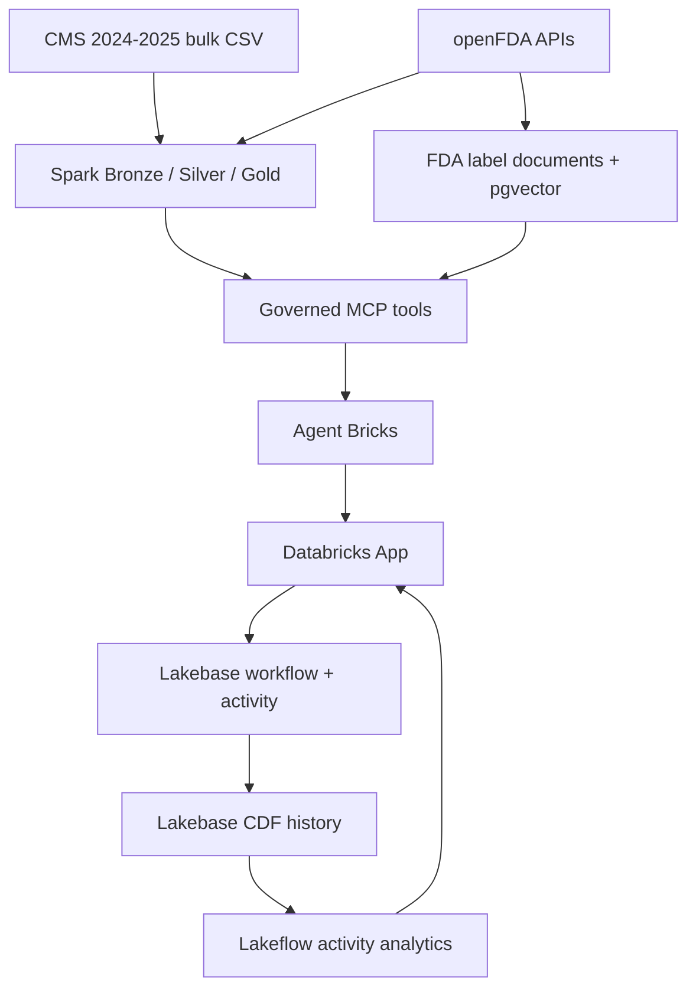

# Pharma Market & Financial Intelligence 2.0

Databricks capstone for evidence-grounded analysis of national CMS Medicaid utilization and reimbursement, enriched with openFDA product metadata and unstructured Drug Label text. A governed Agent Bricks agent retrieves evidence and, only after explicit user approval, writes investigations, notes, and follow-up actions to Lakebase.

> Medicaid reimbursement is not manufacturer revenue, net sales, profit, list price, or realized net price. FDA label text is product context, not medical advice.

## Final delivery scope

This is the smallest complete version of the approved proposal that satisfies the capstone rubric:

- National 2024-2025 CMS State Drug Utilization ingestion in Spark.
- Bronze, Silver, and Gold Delta tables in Unity Catalog.
- Live openFDA NDC and Drug Label API integration with retry/error handling.
- FDA label normalization, chunking, MiniLM embeddings, and Lakebase pgvector retrieval.
- Normalized Lakebase operational model for investigations, findings, notes, follow-ups, and agent activity.
- Agent Bricks plus governed read and write tools, with explicit write approval.
- Lakebase CDF to an incremental Lakeflow analytics pipeline.
- One deployed Databricks frontend App, backed by one MCP App and one Agent endpoint.
- Big Data Volume and Variety, demonstrated with measured row/document counts.

The SEC module described as a proposal extension is intentionally deferred. It is not needed to demonstrate either required Big Data V and would add deployment risk without closing a rubric gap.

## Architecture



Analytical facts remain in Delta/Unity Catalog. Mutable workflow and semantic state remain in Lakebase. The agent cannot update CMS, FDA, or Gold facts.

## Rubric mapping

| Rubric component | Implemented evidence |
|---|---|
| Spark pipeline | `pipeline/01_ingest_medicaid.py` through `04_enrich_openfda.py`; idempotent Bronze merge, typed/deduplicated Silver, four Gold marts, and a measured quality summary |
| Third-party API | `pipeline/openfda_client.py`; live NDC and Drug Label calls, timeouts, retries, rate-limit handling, malformed-response handling, validation, and persisted downstream use |
| Lakebase model | `sql/lakebase_schema.sql`; relational keys, checks, timestamps, indexes, pgvector, activity events, and `REPLICA IDENTITY FULL` |
| Action-taking agent | `mcp_server/finance_mcp_server.py`; seven read tools and five Lakebase write/update tools; frontend approval flow in `frontend/agent_client.py` |
| Analytics pipeline | `pipeline/06_activity_analytics_dlt.py`; Lakebase CDF history to Silver event tables and daily Gold usage/workflow metrics |
| Frontend | `frontend/`; dashboard, agent chat, write approval, saved investigations, notes, actions, scale evidence, and CDF analytics state |
| Deployed application | Databricks App deployment procedure and evidence checklist in `RUN_IN_DATABRICKS.md` and `evidence/README.md` |
| Big Data Vs | Volume: national 2024-2025 CMS sources, expected 10,616,954 source rows and verified from the deployed table. Variety: CSV/JSON plus normalized, chunked, embedded FDA label text |

## Data pipeline

1. `01_ingest_medicaid.py` streams each official annual CMS CSV once into a Unity Catalog Volume, reads it with distributed Spark, retains raw strings and provenance, hashes each record, and merges idempotently into `bronze_raw_medicaid_utilization`.
2. `02_transform_silver.py` types values, normalizes NDC11, preserves suppressed values as null, rejects invalid quarter/NDC records, and deduplicates by record hash.
3. `03_build_gold.py` creates quarterly, YoY, state, portfolio, and quality-summary Delta tables. Its exact symmetric decomposition separates prescription-volume and reimbursement-per-prescription effects.
4. `04_enrich_openfda.py` calls openFDA for the top products and stores structured product records and real label narratives in Lakebase.
5. `05_ingest_drug_embeddings.py` embeds only new or changed document chunks into Lakebase pgvector.
6. `06_activity_analytics_dlt.py` incrementally reads Lakebase CDF history tables and publishes daily Delta metrics.

`MEDICAID_STATES=ALL` and `CMS_MODE=bulk_csv` are the final defaults. A smaller state list remains supported for a quick diagnostic run, but must not be presented as national evidence.

## Lakebase model and real writes

| Table | Purpose | Agent/application write |
|---|---|---|
| `drug_products` | openFDA product identity and matching provenance | Pipeline upsert |
| `drug_documents` | normalized FDA label narratives | Pipeline upsert |
| `drug_embeddings` | semantic chunks and vectors | Pipeline rebuild on changed hash |
| `investigations` | saved analytical questions and summaries | Create; update status |
| `investigation_findings` | evidence-backed findings | Create with investigation |
| `analyst_notes` | human review context | Create |
| `follow_up_actions` | assigned workflow actions | Create; update status |
| `agent_activity_events` | privacy-minimal usage/action events | Append |

Operational tables use primary/foreign keys, status checks, timestamps, indexes, and full replica identity. No prompt text, credentials, or confidential source data is written to the activity table.

## Agent capabilities

Read tools: `get_market_overview`, `get_product_performance`, `get_variance_drivers`, `decompose_reimbursement_change`, `detect_reimbursement_outliers`, `get_drug_profile`, and `search_drug_context`.

Write tools: `save_investigation`, `add_analyst_note`, `create_follow_up_action`, `update_investigation_status`, and `update_follow_up_action`.

The frontend automatically approves read-only MCP calls. A signed, expiring approval card is required before any protected write proceeds.

## Lakebase CDF analytics

Lakebase CDF writes immutable `lb_<table_name>_history` Delta tables. The Lakeflow pipeline produces `silver_agent_activity_events`, `gold_agent_activity_daily`, `silver_workflow_changes`, and `gold_workflow_changes_daily`.

The daily outputs support request/event volume, successes, errors, latency, sessions, approved writes, and investigation/follow-up change counts. CDF is a Databricks Public Preview feature and must be enabled in the target workspace.

## Repository layout

```text
pipeline/       Spark, openFDA, embeddings, and CDF analytics
mcp_server/     Governed retrieval and action tools
frontend/       Databricks App
sql/            Lakebase DDL and CDF verification SQL
agent/          Agent Bricks prompt, tools, and demo prompts
tests/          Offline unit tests
evidence/       Final screenshots and deployment evidence checklist
```

## Configuration

| Setting | Default | Purpose |
|---|---|---|
| `catalog` / `CATALOG` | `bootcamp_students` | Bootcamp-provided Unity Catalog catalog |
| `schema` / `SCHEMA` | `merediver` | Existing student schema for Delta tables and CDF analytics |
| `volume` / `VOLUME` | `pharma_pipeline` | Durable landing area for official bulk CSVs |
| `MEDICAID_STATES` | `ALL` | National run; or two-letter diagnostic list |
| `CMS_MODE` | `bulk_csv` | Required mode for national run |
| `MAX_OPENFDA_PRODUCTS` | `30` in the bundle | Bounded API enrichment |
| `APP_SCHEMA` | `pharma_intelligence` | Lakebase schema |
| `lakebase_endpoint_name` | no default | Full Lakebase endpoint resource name; never commit credentials |

## Run and deploy

Follow [RUN_IN_DATABRICKS.md](RUN_IN_DATABRICKS.md) in order. The critical sequence is:

1. Configure catalog/schema and Lakebase.
2. Deploy and run the national Spark workflow.
3. Deploy the MCP App and Agent Bricks endpoint.
4. Deploy the frontend App and execute one approved write.
5. Start Lakebase CDF.
6. Run the activity analytics pipeline.
7. Capture the required evidence and build the final ZIP.

## Local verification

```bash
python -m compileall .
pytest -q
python scripts/smoke_test.py
```

No local test claims to execute Spark, openFDA, Lakebase CDF, Agent Bricks, or Databricks deployment.

## Submission

After the Databricks run and screenshots are complete:

```bash
python scripts/build_submission_zip.py
```

The builder excludes Git metadata, caches, raw source data, Delta files, model caches, videos, and generated ZIPs. It includes source, tests, documentation, and the lightweight `evidence/` folder.

## Limitations

- The displayed row count must come from the completed deployed pipeline; the expected 10,616,954 source rows are not a substitute for execution evidence.
- CMS suppression remains unavailable, never zero.
- NDC reconciliation is imperfect; exact, fallback, and unmatched outcomes stay explicit.
- Two years support YoY comparison, not forecasting or causal inference.
- The final implementation does not include SEC EDGAR; FDA label text supplies the required unstructured-data Variety.
- CDF and App functionality require the user's Databricks workspace and cannot be truthfully verified offline.
